# **Use Case 05-Performing Sentiment analysis and Text translation with AI Skills in Microsoft Fabric**
**Introduction**

Azure AI services help developers and organizations rapidly create
intelligent, cutting-edge, market-ready, and responsible applications
with out-of-the-box and pre-built and customizable APIs and models. In
this article, you'll use the various services available in Azure AI
services to perform tasks that include: text analytics, translation,
document intelligence, vision, image search, speech to text and text to
speech conversion, anomaly detection, and data extraction from web APIs.

The goal of Azure AI services is to help developers create applications
that can see, hear, speak, understand, and even begin to reason. The
catalog of services within Azure AI services can be categorized into
five main pillars: Vision, Speech, Language, Web search, and Decision.

**Objective:**

- Create a multi-service resource for Azure AI services using the Azure
  portal.

- Create a workspace and lakehouse in Microsoft Fabric with the Fabric
  trial enabled.

- Generate a notebook for interactive data exploration.

- Import required libraries and initialize your Spark session

- Utilize the Text Analytics service to analyze the sentiment of input
  text.

- Utilize the Text Analytics for Health Service to extract and label
  relevant medical information from unstructured text.

- Utilize the Azure Translator, a cloud-based machine translation
  service, to translate text from one language to another.

- Extract information from a document into structured data

-  Image analysis and tagging using Azure Computer Vision.

- Search for images that are related to a natural language query

- working on a speech-to-text transcription task using Spark and the
  Speech toText SDK.

- Develop a text-to-speech service that enables applications to convert
  written text into natural-sounding speech.

- Uses the Anomaly Detector service to find anomalies in entire time
  series data

- Get information from arbitrary web APIs

# **Exercise 1: Setup Lakehouse and create Azure AI service**

## Task 1: Assign Cognitive Services Contributor roles using the Azure portal

1.  Open your browser, navigate to the address bar, and type or paste
    the following URL:+++https://portal.azure.com/+++, then press
    the **Enter** button.

      

2.  In the **Microsoft Azure** window, enter your **Sign-in**
    credentials, and click on the **Next** button.
      

3.  Then, enter the password and click on the **Sign in** button**.**

     

4.  In **Stay signed in?** window, click on the **Yes** button.

      

5.  Type in **Subscriptions** in the search bar and select
    **Subscriptions**.

     

6.  Click on your assigned **subscription**.

      

7.  From the left menu, click on the **Access control(IAM).**

     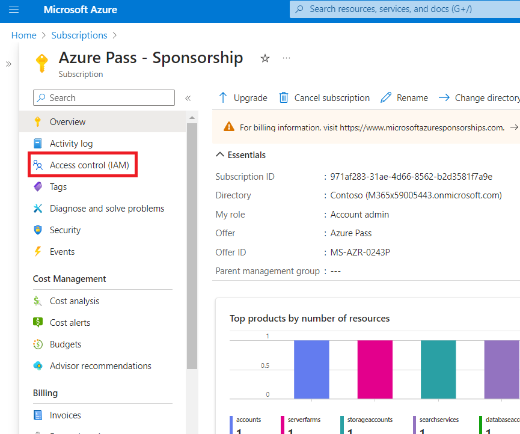

8.  On the Access control(IAM) page, Click +**Add** and select **Add
    role assignments.**

      

9.  Type the **Cognitive Services Contributor** in the search box and
    select it. Click **Next**

     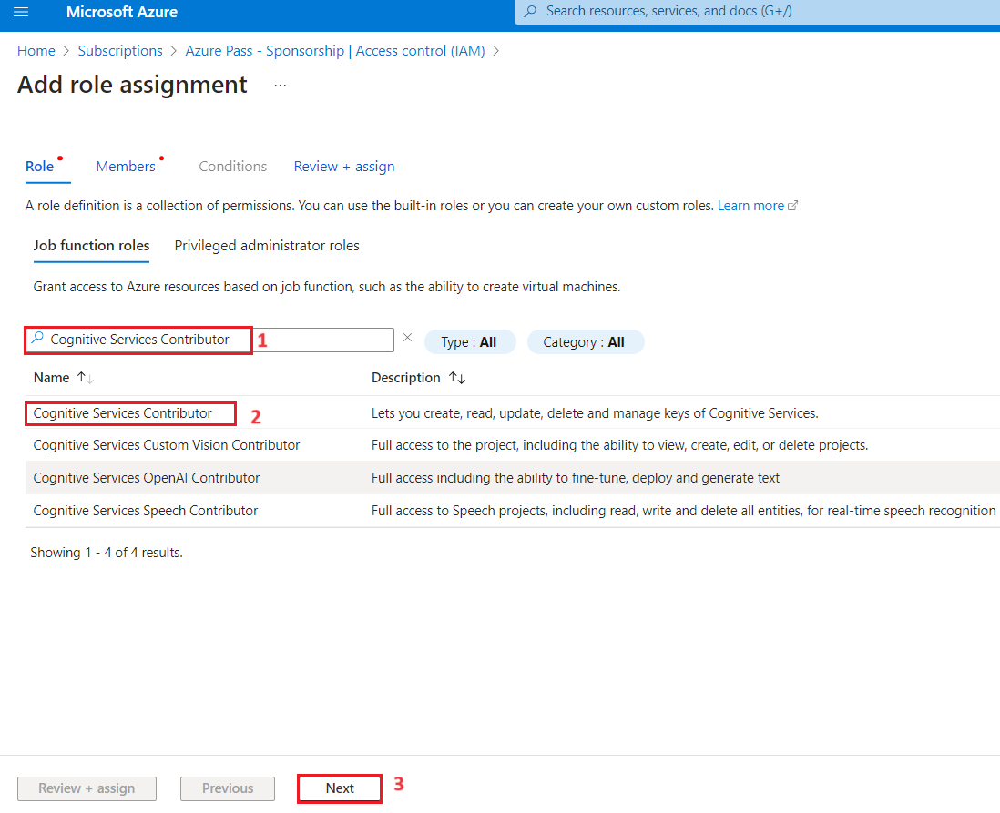

10. In the **Add role assignment** tab, select Assign access to User
    group or service principal. Under Members, click **+Select members**

     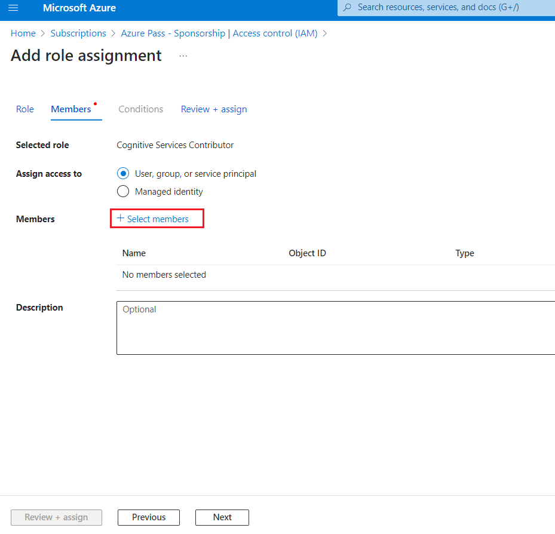

11. On the Select members tab , search your Azure OpenAI subscription
    and click **Select.**

     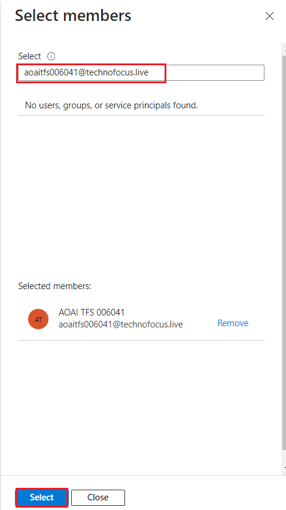

8.  In the **Add role assignment** page, Click **Review + Assign**, you
    will get a notification once the role assignment is complete.

     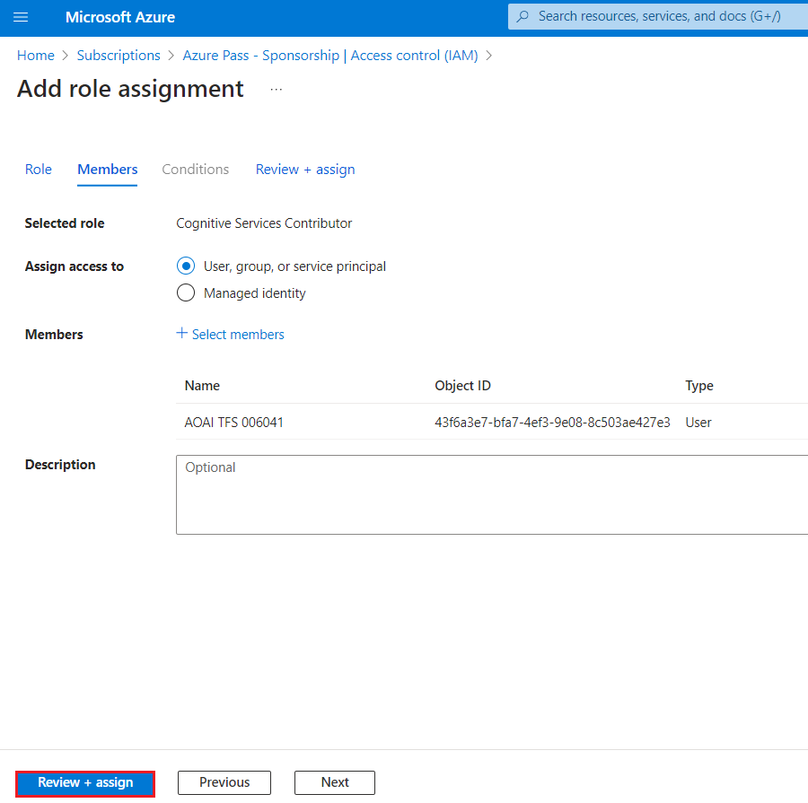

     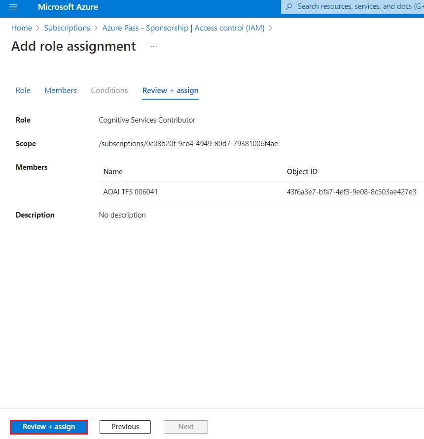

9.  You will see a notification – added as Cognitive Services
    Contributor for Azure Pass-Sponsorship.

      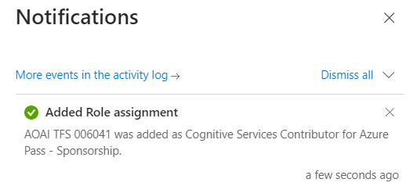

## Task 2: Create a multi-service resource for Azure AI services

he multi-service resource is listed under **Azure AI
services** \> **Azure AI services multi-service account** in the portal.
To create a multi-service resource follow these instructions:

1.  Select this link to create a multi-service
    resource: +++https://portal.azure.com/#create/Microsoft.CognitiveServicesAllInOne+++

2.  On the **Create** page, provide the following information:

|Project details	|Description|
|-------|-------|
|Subscription |Select one of your available Azure subscriptions	|
|Resource group |Click on Create new> enter +++AI-FabricXX+++(XX can be a unique number)|
|Region |Select the appropriate region for your CognitiveServices. In this lab, we have chosen the East US 2 region.	|
|Name|Cognitive-serviceXXX( XXX can be a unique number|
|Pricing tier|Standard S0

3.  Configure other settings for your resource as needed, read and
    accept the conditions (as applicable), and then select **Review +
    create**.

     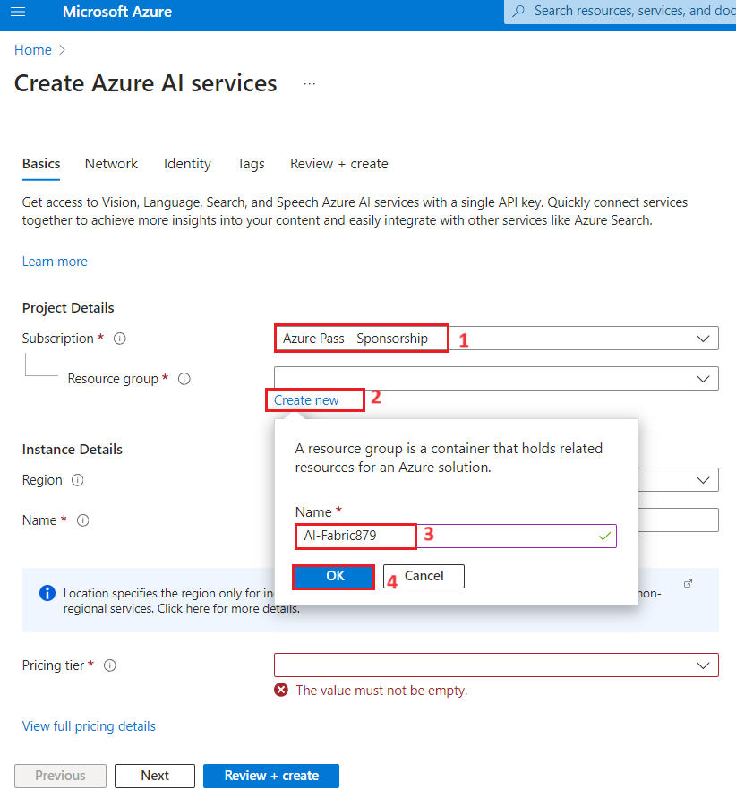

     

4.  In the **Review+submit** tab, once the Validation is Passed, click
    on the **Create** button.

      

5.  After the deployment is completed, click on the **Go to resource**
    button.

     

6.  In your **Azure AI service** window, navigate to the **Resource
    Management** section, and click on **Keys and Endpoints**.

     

7.  In **Keys and Endpoints** page, copy **KEY1, KEY 2,**
    **Location/Region** and **Endpoint** values and paste them in a
    notepad as shown in the below image, then **Save** the notepad to
    use the information in the upcoming lab.

     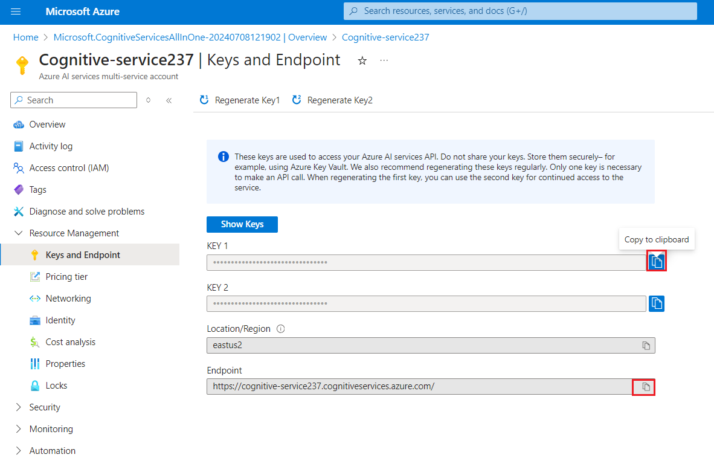

## **Task 3: Create a Fabric workspace**

In this task, you create a Fabric workspace. The workspace contains all
the items needed for this lakehouse tutorial, which includes lakehouse,
dataflows, Data Factory pipelines, the notebooks, Power BI datasets, and
reports.

1.  Open your browser, navigate to the address bar, and type or paste
    the following URL: +++https://app.fabric.microsoft.com/+++ then press
    the **Enter** button.

      

2.  In the **Microsoft Fabric** window, enter your **Microsoft 365**
    credentials, and click on the **Submit** button.

      

3.  Then, In the **Microsoft** window enter the password and click on
    the **Sign in** button . 

      

4.  In **Stay signed in?** window, click on the **Yes** button.

      

5.  You’ll be directed to Power BI Home page.

      

8.  Go back to **Power BI** window. On the left side navigation menu of
    Power BI Home page, navigate and click on **Workspaces**.

     

9.  In the Workspaces pane, click on **+** **New workspace** button**.**

      

10. In the **Create a workspace** pane that appears on the right side,
    enter the following details, and click on the **Apply** button.

|	||
|-------|-------|
|Name | +++AI-Fabric-XXX+++(XXX can be a unique number) 	|
|Advanced |Under License mode, select Trial	|
|Default storage format|Small dataset storage format	|
|Template apps|Check the Develop template apps|

>    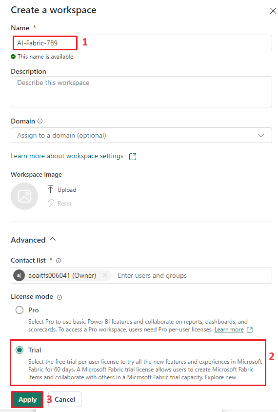

11. Wait for the deployment to complete. It takes 2-3 minutes to
    complete.

     

## **Task 4: Create a lakehouse and create a notebook**

1.  In the **AI-Fabric-XXX** page, click on the **Power BI** icon
    located at the bottom left and select **Data Engineering** under
    Synapse.

      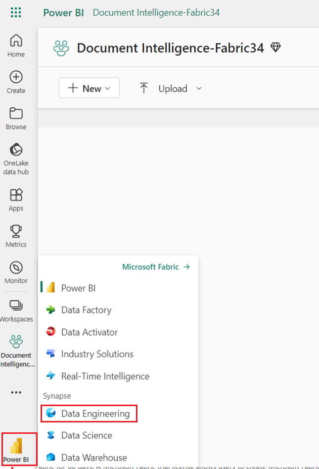

2.  In the **Synapse** **Data Engineering** **Home** page,
    select **Lakehouse** to create a lakehouse.

      

3.  In the **New lakehouse** dialog box, enter
    **+++AI_Fabric_lakehouseXX+++** in the **Name** field, click on the
    **Create** button and open the new lakehouse.

> **Note**: Ensure to remove space before **AI_Fabric_lakehouseXX**.
>      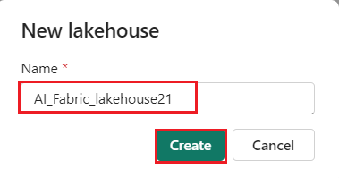

4.  You will see a notification stating **Successfully created SQL
    endpoint**.

     

      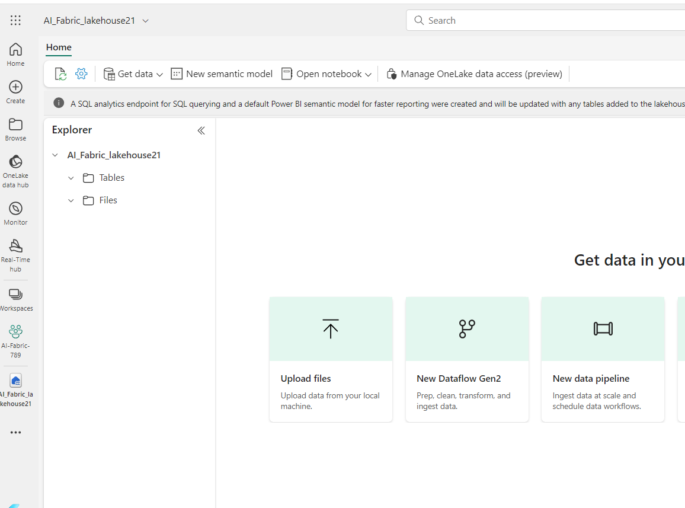

12. In the **Lakehouse** page, navigate and click on **Open notebook**
    drop in the command bar, then select **New notebook**.

      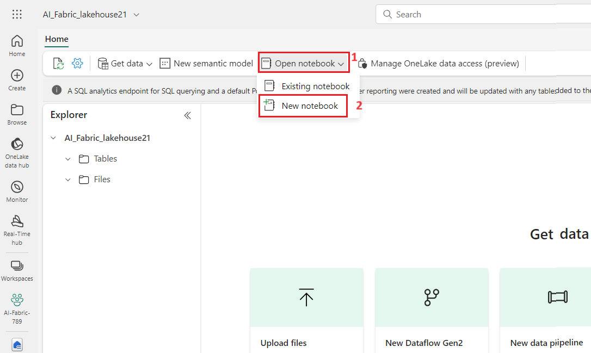

# Exercise 2: **Use Azure AI services with SynapseML in Microsoft Fabric**

## Task 1: Import required libraries and initialize Spark session.

To begin, import required libraries and initialize your Spark session.

1.  In the query editor, paste the following code to import required
    libraries

**Copy**
```
from pyspark.sql.functions import udf, col
from synapse.ml.io.http import HTTPTransformer, http_udf
from requests import Request
from pyspark.sql.functions import lit
from pyspark.ml import PipelineModel
from pyspark.sql.functions import col
import os
```
>
     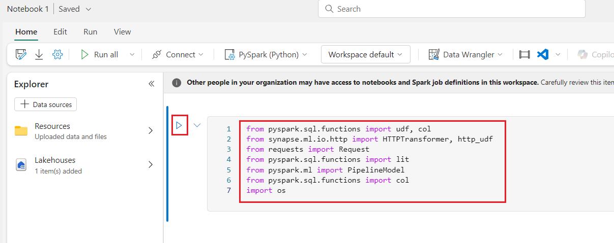
     

2.  Use the **+ Code** icon below the cell output to add a new code cell
    to the notebook, and enter the following code in it. Click on **▷
    Run cell** button and review the output

**Copy**
```
from pyspark.sql import SparkSession
from synapse.ml.core.platform import *

# Bootstrap Spark Session
spark = SparkSession.builder.getOrCreate()
```
>
     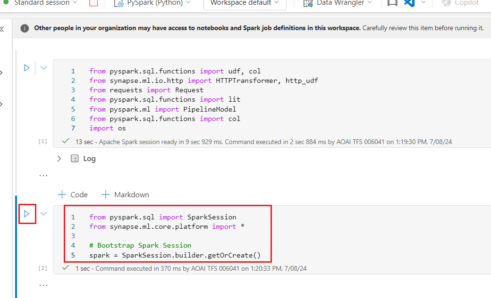

3.  Import Azure AI services libraries and replace the keys and
    locations in the following code snippet with your Azure AI services
    key and location.

4.  Use the **+ Code** icon below the cell output to add a new code cell
    to the notebook

5.  Replace your **Azure AI services key** and **location**.

**Copy**
```
from synapse.ml.cognitive import *

# A general Azure AI services key for Text Analytics, Vision and Document Intelligence (or use separate keys that belong to each service)
service_key = "<YOUR-KEY-VALUE>" # Replace <YOUR-KEY-VALUE> with your Azure AI service key, check prerequisites for more details
service_loc = "eastus"

# A Bing Search v7 subscription key
bing_search_key =  "<YOUR-KEY-VALUE>" # Replace <YOUR-KEY-VALUE> with your Bing v7 subscription key, check prerequisites for more details

# An Anomaly Detector subscription key
anomaly_key = <"YOUR-KEY-VALUE"> # Replace <YOUR-KEY-VALUE> with your anomaly service key, check prerequisites for more details
anomaly_loc = "westus2"

# A Translator subscription key
translator_key = "<YOUR-KEY-VALUE>" # Replace <YOUR-KEY-VALUE> with your translator service key, check prerequisites for more details
translator_loc = "eastus"

# An Azure search key
search_key = "<YOUR-KEY-VALUE>" # Replace <YOUR-KEY-VALUE> with your search key, check prerequisites for more details
```
   

## Task 2: Perform sentiment analysis on text

The [Text
Analytics](https://azure.microsoft.com/products/ai-services/text-analytics/) service
provides several algorithms for extracting intelligent insights from
text. For example, you can use the service to find the sentiment of some
input text. The service will return a score between 0.0 and 1.0, where
low scores indicate negative sentiment and high scores indicate positive
sentiment.

1.  Use the **+ Code** icon below the cell output to add a new code cell
    to the notebook

2.  Enter the following code in it. Click on ▷ Run cell button and
    review the output

**Copy**
```
# Create a dataframe that's tied to it's column names
df = spark.createDataFrame(
    [
        ("I am so happy today, its sunny!", "en-US"),
        ("I am frustrated by this rush hour traffic", "en-US"),
        ("The cognitive services on spark aint bad", "en-US"),
    ],
    ["text", "language"],
)

# Run the Text Analytics service with options
sentiment = (
    TextSentiment()
    .setTextCol("text")
    .setLocation(service_loc)
    .setSubscriptionKey(service_key)
    .setOutputCol("sentiment")
    .setErrorCol("error")
    .setLanguageCol("language")
)

# Show the results of your text query in a table format
display(
    sentiment.transform(df).select(
        "text", col("sentiment.document.sentiment").alias("sentiment")
    )
)

```
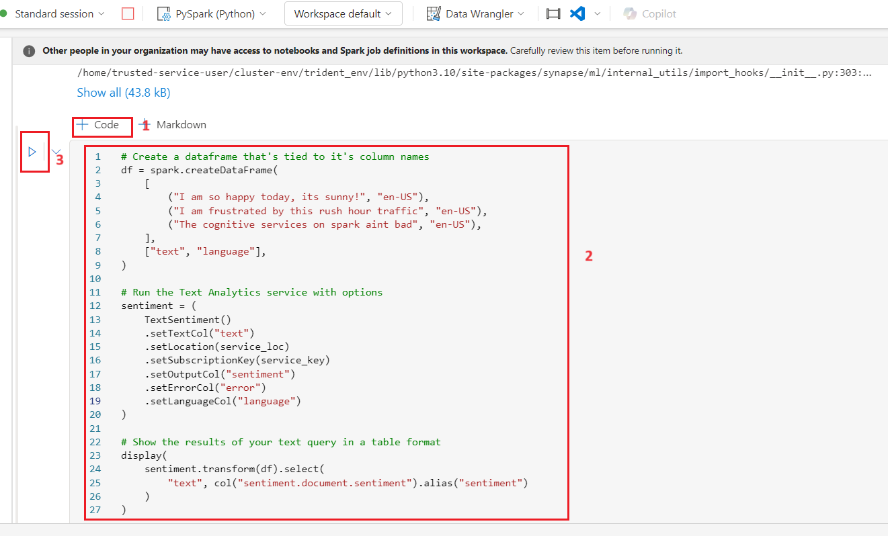

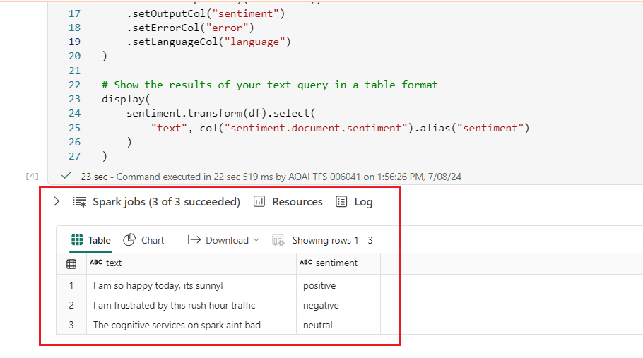

## Task 3: Perform text analytics for health data

The [Text Analytics for Health
Service](https://github.com/MicrosoftDocs/fabric-docs/blob/main/azure/ai-services/language-service/text-analytics-for-health/overview?tabs=ner) extracts
and labels relevant medical information from unstructured text such as
doctor's notes, discharge summaries, clinical documents, and electronic
health records.

1.  The following code sample analyzes and transforms text from doctors
    notes into structured data.

2.  Use the **+ Code** icon below the cell output to add a new code cell
    to the notebook

3.  Enter the following code in it. Click on ▷ Run cell button and
    review the output

**Copy**
```
df = spark.createDataFrame(
    [
        ("20mg of ibuprofen twice a day",),
        ("1tsp of Tylenol every 4 hours",),
        ("6-drops of Vitamin B-12 every evening",),
    ],
    ["text"],
)

healthcare = (
    AnalyzeHealthText()
    .setSubscriptionKey(service_key)
    .setLocation(service_loc)
    .setLanguage("en")
    .setOutputCol("response")
)

display(healthcare.transform(df))
```

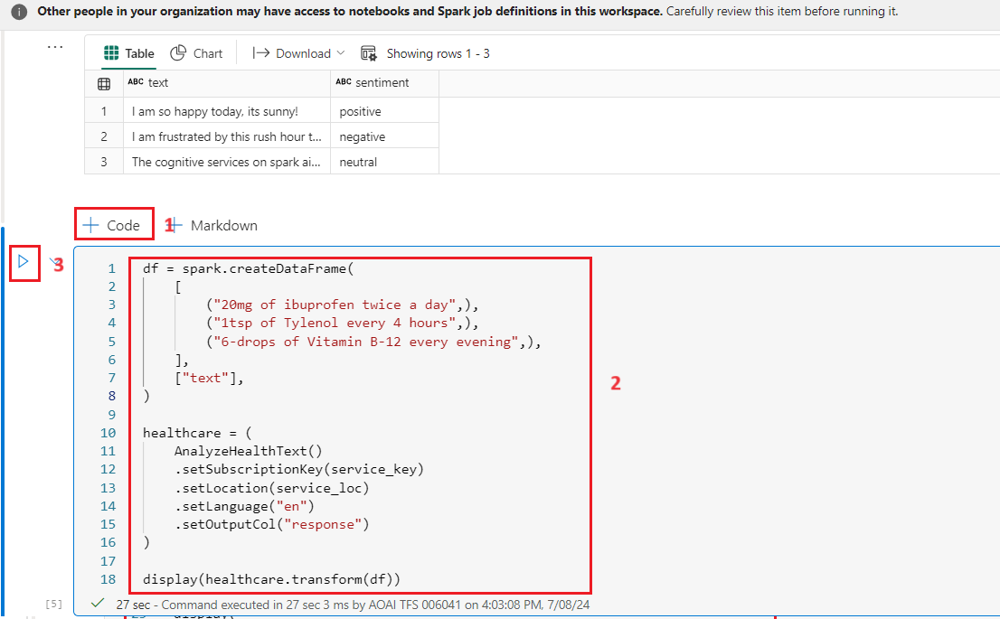

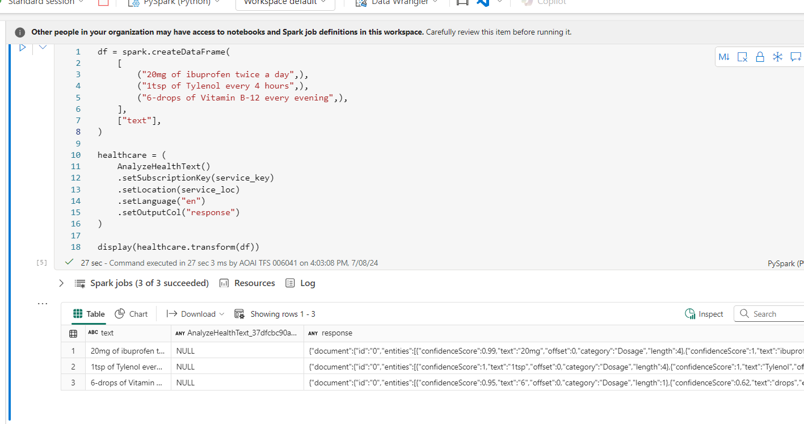

## Task 4: Translate text into a different language

[Translator](https://azure.microsoft.com/products/ai-services/translator/) is
a cloud-based machine translation service and is part of the Azure AI
services family of cognitive APIs used to build intelligent apps.
Translator is easy to integrate in your applications, websites, tools,
and solutions. It allows you to add multi-language user experiences in
90 languages and dialects and can be used for text translation with any
operating system.

1.  The following code sample does a simple text translation by
    providing the sentences you want to translate and target languages
    you want to translate them to.

2.  Use the **+ Code** icon below the cell output to add a new code cell
    to the notebook

3.  Enter the following code in it. Click on **▷ Run cell** button and
    review the output

**Copy**
```
from pyspark.sql.functions import col, flatten
# Create a dataframe including sentences you want to translate
df = spark.createDataFrame(
    [(["Hello, what is your name?", "Bye"],)],
    [
        "text",
    ],
)

# Run the Translator service with options
translate = (
    Translate()
    .setSubscriptionKey(translator_key)
    .setLocation(translator_loc)
    .setTextCol("text")
    .setToLanguage(["zh-Hans"])
    .setOutputCol("translation")
)

# Show the results of the translation.
display(
    translate.transform(df)
    .withColumn("translation", flatten(col("translation.translations")))
    .withColumn("translation", col("translation.text"))
    .select("translation")
)
```
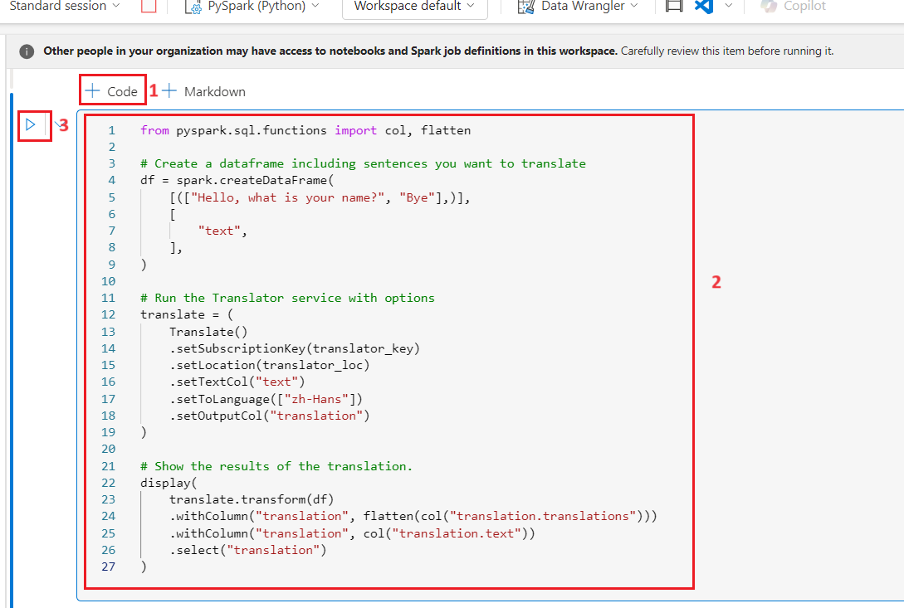


## Task 5: Extract information from a document into structured data

[Azure AI Document
Intelligence](https://azure.microsoft.com/products/ai-services/ai-document-intelligence/) is
a part of Azure AI services that lets you build automated data
processing software using machine learning technology. With Azure AI
Document Intelligence, you can identify and extract text, key/value
pairs, selection marks, tables, and structure from your documents. The
service outputs structured data that includes the relationships in the
original file, bounding boxes, confidence and more.

1.  The following code sample analyzes a business card image and
    extracts its information into structured data.

2.  Use the **+ Code** icon below the cell output to add a new code cell
    to the notebook

3.  Enter the following code in it. Click on ▷ Run cell button and
    review the output

**Copy**
```
from pyspark.sql.functions import col, explode
# Create a dataframe containing the source files
imageDf = spark.createDataFrame(
    [
        (
            "https://mmlspark.blob.core.windows.net/datasets/FormRecognizer/business_card.jpg",
        )
    ],
    [
        "source",
    ],
)

# Run the Form Recognizer service
analyzeBusinessCards = (
    AnalyzeBusinessCards()
    .setSubscriptionKey(service_key)
    .setLocation(service_loc)
    .setImageUrlCol("source")
    .setOutputCol("businessCards")
)

# Show the results of recognition.
display(
    analyzeBusinessCards.transform(imageDf)
    .withColumn(
        "documents", explode(col("businessCards.analyzeResult.documentResults.fields"))
    )
    .select("source", "documents")
)
```

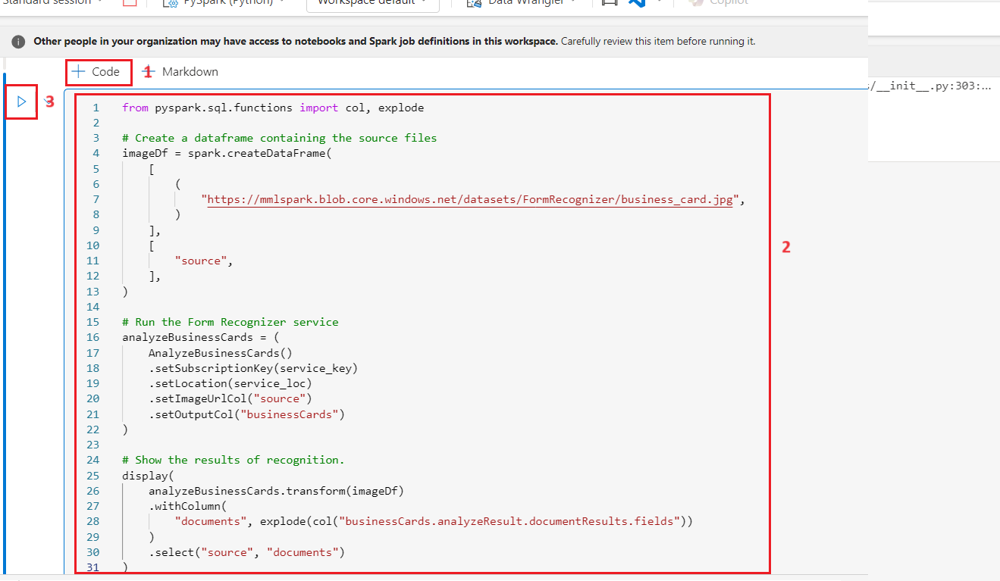

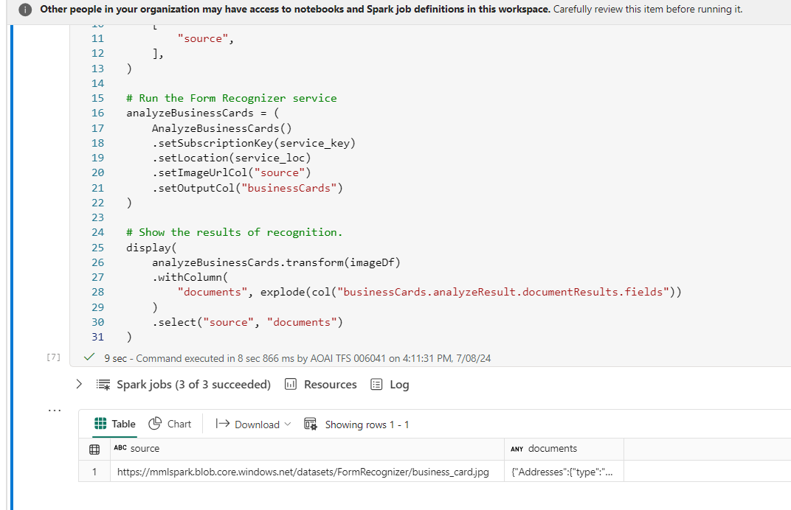

## Task 6: Analyze and tag images

[Computer
Vision](https://azure.microsoft.com/products/ai-services/ai-vision/) analyzes
images to identify structure such as faces, objects, and
natural-language descriptions.

1.  The following code sample analyzes images and labels them
    with *tags*. Tags are one-word descriptions of things in the image,
    such as recognizable objects, people, scenery, and actions.

2.  Use the **+ Code** icon below the cell output to add a new code cell
    to the notebook

3.  Enter the following code in it. Click on ▷ Run cell button and
    review the output

**Copy**
```
# Create a dataframe with the image URLs
base_url = "https://raw.githubusercontent.com/Azure-Samples/cognitive-services-sample-data-files/master/ComputerVision/Images/"
df = spark.createDataFrame(
    [
        (base_url + "objects.jpg",),
        (base_url + "dog.jpg",),
        (base_url + "house.jpg",),
    ],
    [
        "image",
    ],
)

# Run the Computer Vision service. Analyze Image extracts information from/about the images.
analysis = (
    AnalyzeImage()
    .setLocation(service_loc)
    .setSubscriptionKey(service_key)
    .setVisualFeatures(
        ["Categories", "Color", "Description", "Faces", "Objects", "Tags"]
    )
    .setOutputCol("analysis_results")
    .setImageUrlCol("image")
    .setErrorCol("error")
)

# Show the results of what you wanted to pull out of the images.
display(analysis.transform(df).select("image", "analysis_results.description.tags"))
```
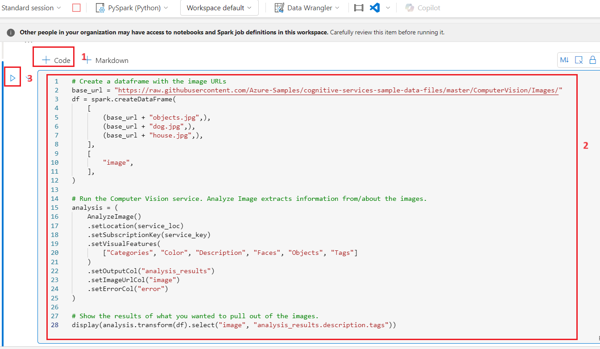

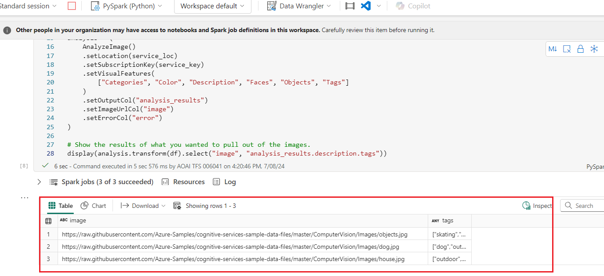

## Task 7: Search for images that are related to a natural language query

[Bing Image
Search](https://www.microsoft.com/bing/apis/bing-image-search-api) searches
the web to retrieve images related to a user's natural language query.

1.  The following code sample uses a text query that looks for images
    with quotes. The output of the code is a list of image URLs that
    contain photos related to the query.

2.  Use the **+ Code** icon below the cell output to add a new code cell
    to the notebook

3.  Enter the following code in it. Click on ▷ Run cell button and
    review the output

**Copy**
```
# Number of images Bing will return per query
imgsPerBatch = 10
# A list of offsets, used to page into the search results
offsets = [(i * imgsPerBatch,) for i in range(100)]
# Since web content is our data, we create a dataframe with options on that data: offsets
bingParameters = spark.createDataFrame(offsets, ["offset"])

# Run the Bing Image Search service with our text query
bingSearch = (
    BingImageSearch()
    .setSubscriptionKey(bing_search_key)
    .setOffsetCol("offset")
    .setQuery("Martin Luther King Jr. quotes")
    .setCount(imgsPerBatch)
    .setOutputCol("images")
)

# Transformer that extracts and flattens the richly structured output of Bing Image Search into a simple URL column
getUrls = BingImageSearch.getUrlTransformer("images", "url")

# This displays the full results returned, uncomment to use
# display(bingSearch.transform(bingParameters))

# Since we have two services, they are put into a pipeline
pipeline = PipelineModel(stages=[bingSearch, getUrls])

# Show the results of your search: image URLs
display(pipeline.transform(bingParameters))
```
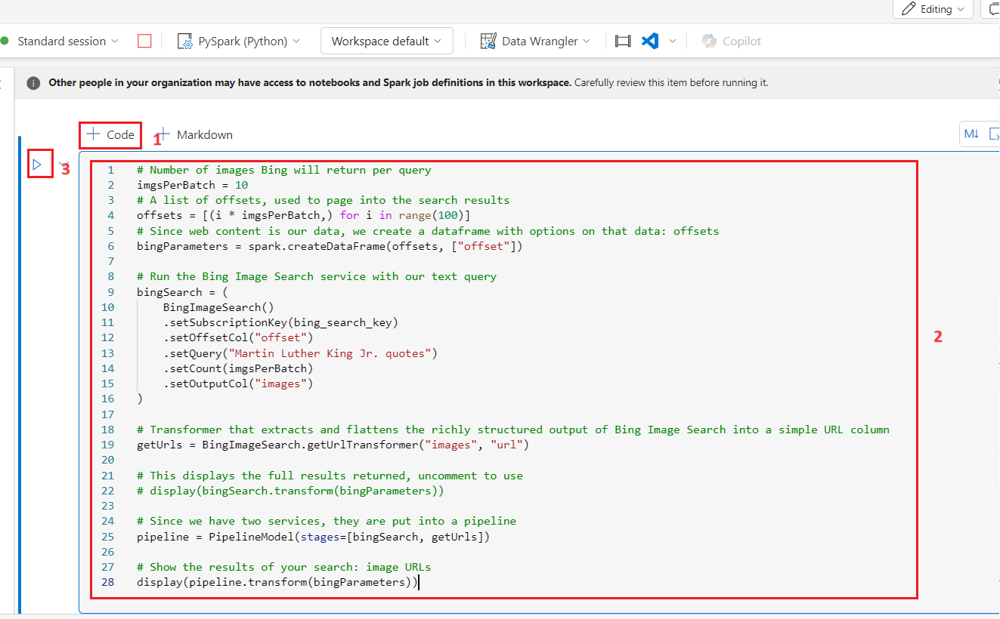

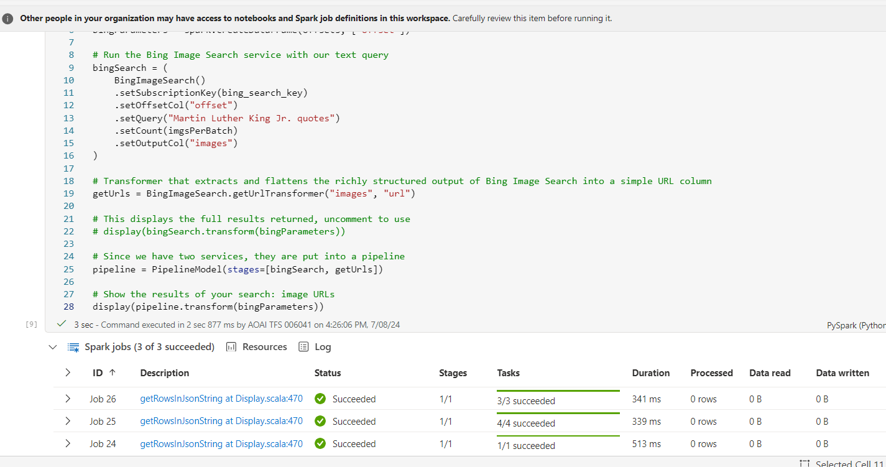

## Task 8: Transform speech to text

The [Speech-to-text](https://azure.microsoft.com/products/ai-services/ai-speech/) service
converts streams or files of spoken audio to text.

1.  The following code sample transcribes one audio file to text.

2.  Use the **+ Code** icon below the cell output to add a new code cell
    to the notebook

3.  Enter the following code in it. Click on **▷ Run cell** button and
    review the output

**Copy**
```
# Create a dataframe with our audio URLs, tied to the column called "url"
df = spark.createDataFrame(
    [("https://mmlspark.blob.core.windows.net/datasets/Speech/audio2.wav",)], ["url"]
)

# Run the Speech-to-text service to translate the audio into text
speech_to_text = (
    SpeechToTextSDK()
    .setSubscriptionKey(service_key)
    .setLocation(service_loc)
    .setOutputCol("text")
    .setAudioDataCol("url")
    .setLanguage("en-US")
    .setProfanity("Masked")
)

# Show the results of the translation
display(speech_to_text.transform(df).select("url", "text.DisplayText"))
```
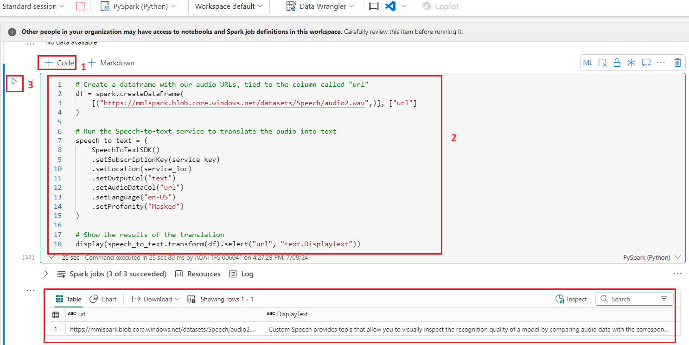

## Task 9: Transform text to speech

[Text to
speech](https://azure.microsoft.com/products/ai-services/text-to-speech/#overview) is
a service that allows you to build apps and services that speak
naturally, choosing from more than 270 neural voices across 119
languages and variants.

1.  The following code sample transforms text into an audio file that
    contains the content of the text.

2.  Use the **+ Code** icon below the cell output to add a new code cell
    to the notebook

3.  Enter the following code in it. Click on **▷ Run cell** button and
    review the output

**Copy**
```
from synapse.ml.cognitive import TextToSpeech

fs = ""
if running_on_databricks():
    fs = "dbfs:"
elif running_on_synapse_internal():
    fs = "Files"

# Create a dataframe with text and an output file location
df = spark.createDataFrame(
    [
        (
            "Reading out loud is fun! Check out aka.ms/spark for more information",
            fs + "/output.mp3",
        )
    ],
    ["text", "output_file"],
)

tts = (
    TextToSpeech()
    .setSubscriptionKey(service_key)
    .setTextCol("text")
    .setLocation(service_loc)
    .setVoiceName("en-US-JennyNeural")
    .setOutputFileCol("output_file")
)
# Check to make sure there were no errors during audio creation
display(tts.transform(df))

```
## Task 10: Detect anomalies in time series data

[Anomaly
Detector](https://azure.microsoft.com/products/ai-services/ai-anomaly-detector) is
great for detecting irregularities in your time series data. The
following code sample uses the Anomaly Detector service to find
anomalies in entire time series data.

1.  Use the **+ Code** icon below the cell output to add a new code cell
    to the notebook

2.  Enter the following code in it. Click on ▷ Run cell button and
    review the output
```
# Create a dataframe with the point data that Anomaly Detector requires
df = spark.createDataFrame(
    [
        ("1972-01-01T00:00:00Z", 826.0),
        ("1972-02-01T00:00:00Z", 799.0),
        ("1972-03-01T00:00:00Z", 890.0),
        ("1972-04-01T00:00:00Z", 900.0),
        ("1972-05-01T00:00:00Z", 766.0),
        ("1972-06-01T00:00:00Z", 805.0),
        ("1972-07-01T00:00:00Z", 821.0),
        ("1972-08-01T00:00:00Z", 20000.0),
        ("1972-09-01T00:00:00Z", 883.0),
        ("1972-10-01T00:00:00Z", 898.0),
        ("1972-11-01T00:00:00Z", 957.0),
        ("1972-12-01T00:00:00Z", 924.0),
        ("1973-01-01T00:00:00Z", 881.0),
        ("1973-02-01T00:00:00Z", 837.0),
        ("1973-03-01T00:00:00Z", 9000.0),
    ],
    ["timestamp", "value"],
).withColumn("group", lit("series1"))

# Run the Anomaly Detector service to look for irregular data
anamoly_detector = (
    SimpleDetectAnomalies()
    .setSubscriptionKey(anomaly_key)
    .setLocation(anomaly_loc)
    .setTimestampCol("timestamp")
    .setValueCol("value")
    .setOutputCol("anomalies")
    .setGroupbyCol("group")
    .setGranularity("monthly")
)

# Show the full results of the analysis with the anomalies marked as "True"
display(
    anamoly_detector.transform(df).select("timestamp", "value", "anomalies.isAnomaly")
)
```

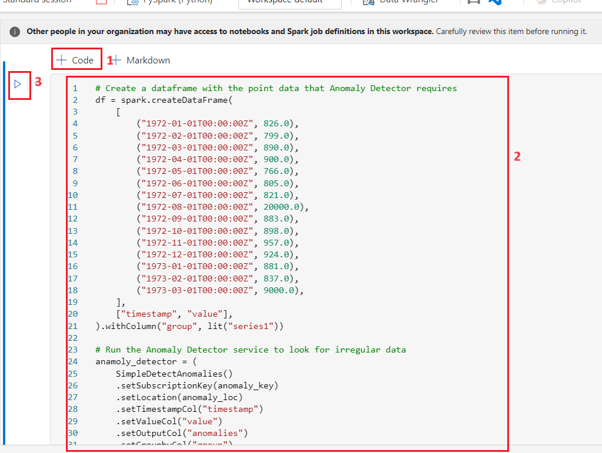

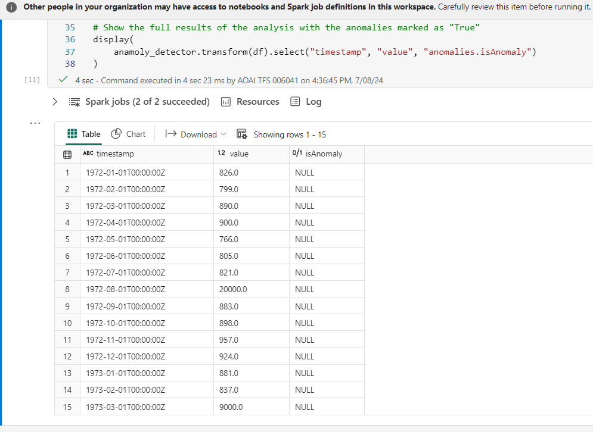

## Task 11: Get information from arbitrary web APIs

With HTTP on Spark, you can use any web service in your big data
pipeline. The following code sample uses the [World Bank
API](http://api.worldbank.org/v2/country/) to get information about
various countries around the world.

1.  Use the **+ Code** icon below the cell output to add a new code cell
    to the notebook

2.  Enter the following code in it. Click on ▷ Run cell button and
    review the output

**Copy**
```
# Use any requests from the python requests library
def world_bank_request(country):
    return Request(
        "GET", "http://api.worldbank.org/v2/country/{}?format=json".format(country)
    )


# Create a dataframe with specifies which countries we want data on
df = spark.createDataFrame([("br",), ("usa",)], ["country"]).withColumn(
    "request", http_udf(world_bank_request)(col("country"))
)

# Much faster for big data because of the concurrency :)
client = (
    HTTPTransformer().setConcurrency(3).setInputCol("request").setOutputCol("response")
)

# Get the body of the response


def get_response_body(resp):
    return resp.entity.content.decode()


# Show the details of the country data returned
display(
    client.transform(df).select(
        "country", udf(get_response_body)(col("response")).alias("response")
    )
)
```
>
     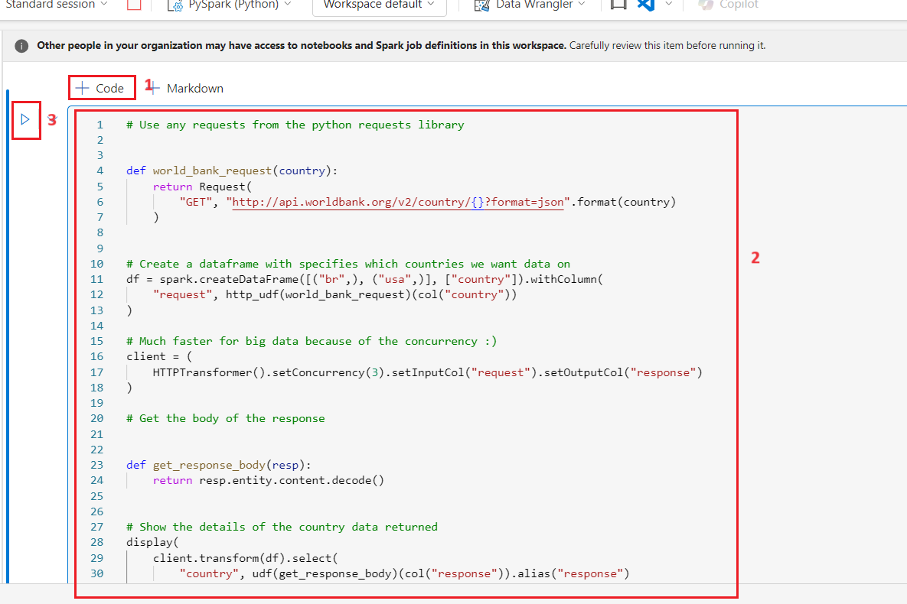
     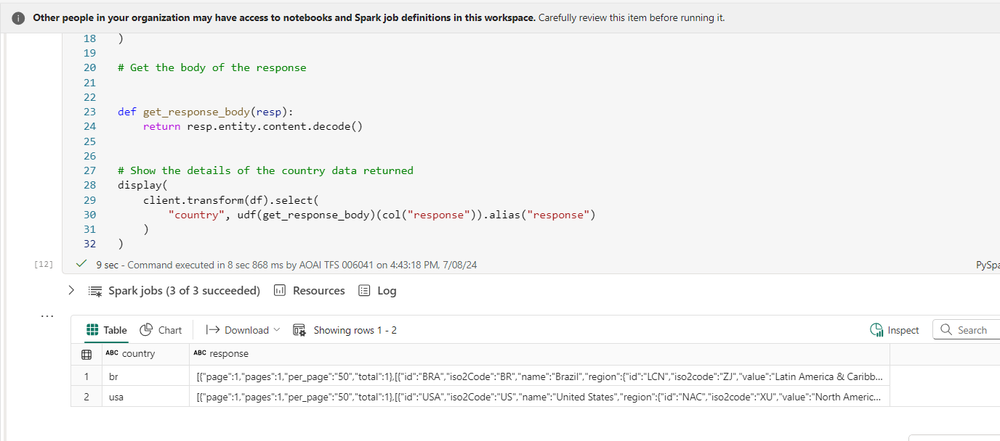

3.  To save notebook, select the drop down for **Notebook1** and enter
   **+++Use Azure AI services with SynapseML+++**.

      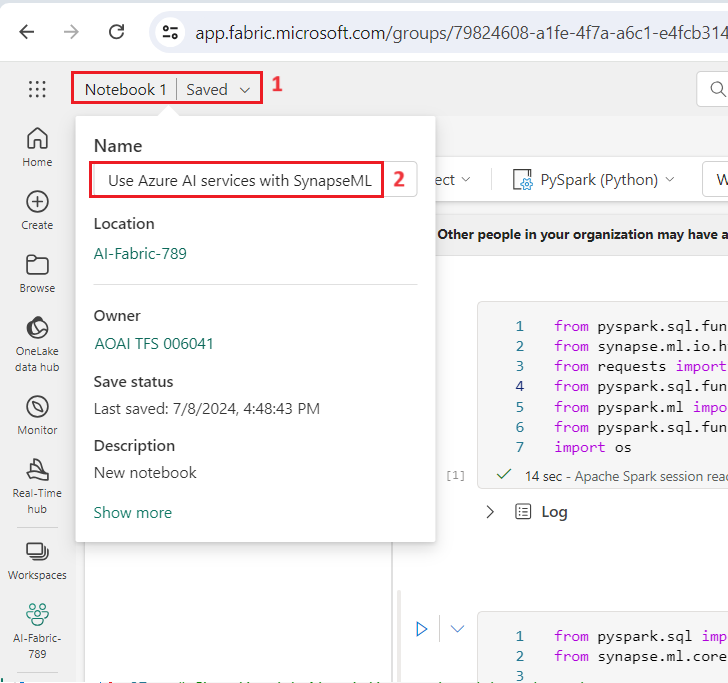

## Task 12: Delete the resources

To avoid incurring unnecessary Azure costs, you should delete the
resources you created in this quickstart if they're no longer needed. To
manage resources, you can use the [Azure
portal](https://portal.azure.com/?azure-portal=true).

1.  To delete the storage account, navigate to **Azure portal Home**
    page, click on **Resource groups**.

      

2.  Click on the assigned resource group.

     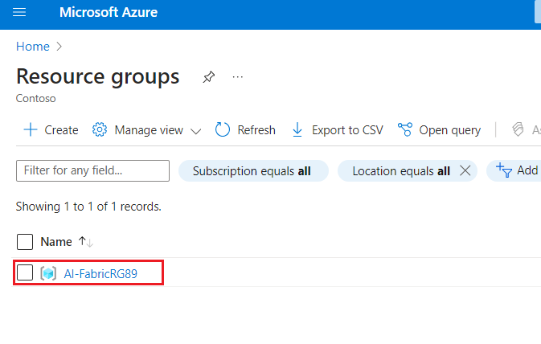

3.  In the **Resource group** home page, select the **delete resource
    group**

     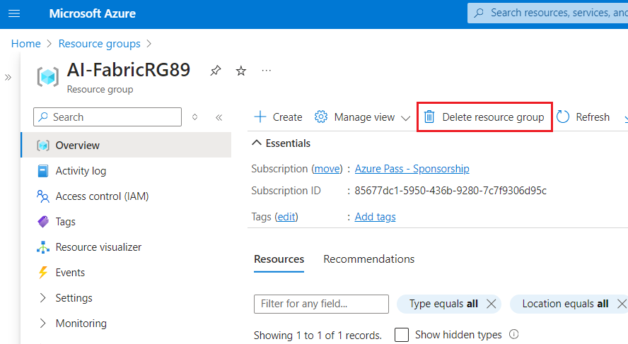

4.  In the **Delete Resources** pane that appears on the right side,
    navigate to **Enter “resource group name” to confirm deletion**
    field, then click on the **Delete** button.

5.  On **Delete confirmation** dialog box, click on **Delete** button.

      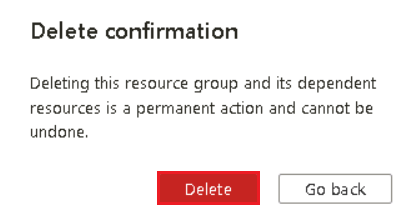
6.  Click on the bell icon, you’ll see the notification –**Deleted
    resource group AOAI-RG8**

     

7.  Open your browser, navigate to the address bar, and type or paste
    the following URL: +++https://app.fabric.microsoft.com/+++ then
    press the **Enter** button.

     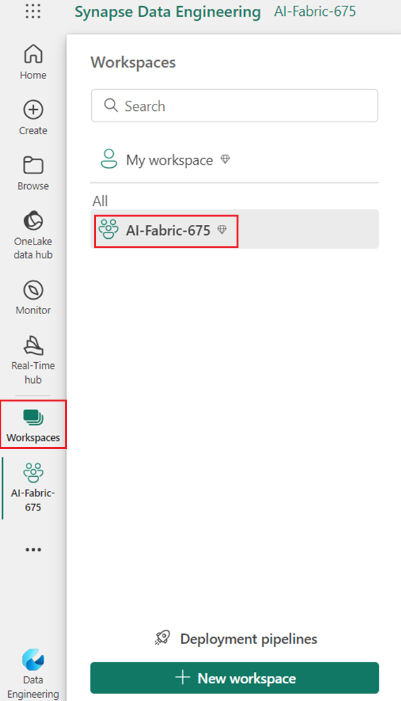

8.  Select the **...** option under the workspace name and
    select **Workspace settings**.

     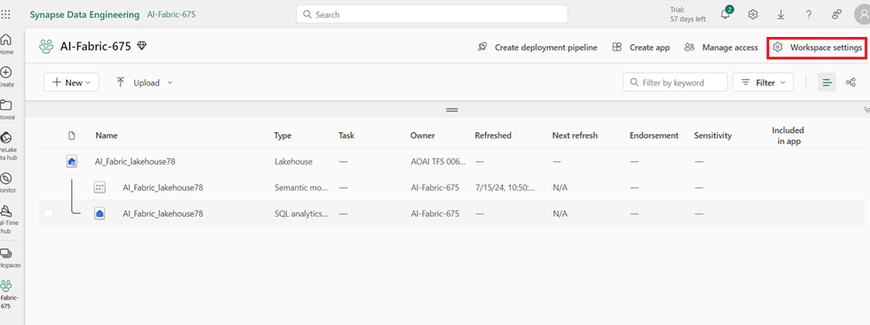

9.  Select **General** and click on **Remove this workspace.**

     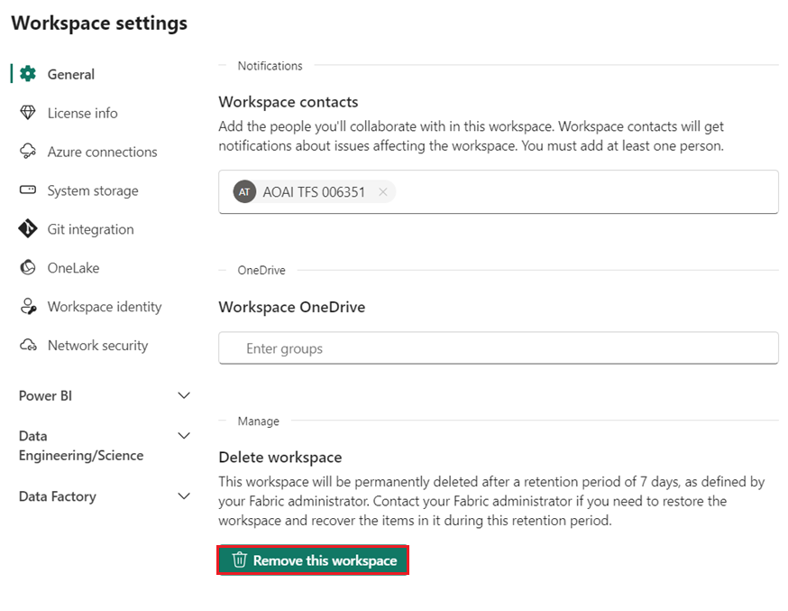

10. Click on **Delete** in the warning that pops up.

      

11. Wait for a notification that the Workspace has been deleted, before
    proceeding to the next lab.

     
